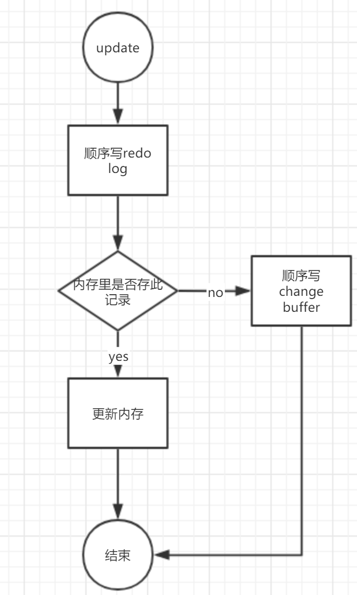

# 01

  

**长连接**  连接对象里面内存 要等断开连接才释放，因为零时使用内存是放在连接对象里的。

建议重连，或者执行较大操作后 5.7mysql_reset_connection 初始化连接资源，不需要权限认证

**短连接** 几次连接就断开，每次连接需要权限认证

# 02

**redo log**

**WAL** write-ahead-logging 先写日志，在写磁盘。 写日志，更新内存，空闲时候更新磁盘，循环写4G

**crash-safe** 数据库异常也不会丢失

  

**随机写变为顺序写**

解决随机写的问题，不能解决随机读 因为都要读到内存

**binlog** 

追加写，逻辑日志 就是sql c=c+1 

statement  就是sql

row格式 就是行内容 更新前更新后两条

redolog 循环追加写。物理日志，数据页做了什么修改  从A改到B

# 03

读视图

没更新一次都会记录一条回滚记录undo log,

**undo log删除时机**

找到当前所有读视图中最早的undo 这条之前的undo都可以删除了，因为没有任何地方会用到借助他回滚

长事务就会存在大量老视图，占用大量存储空间

MVCC通过undo log计算出来的

# 04 索引

为什么不用二叉树？

高度越高访问数据块越多。

因为磁盘访问是按数据块访问的，不是查什么访问什么

# 05 索引下推

联合索引中：

5.6以前 找到最左符合条件的 找主键查到值，然后判断

5.6以后 找到最左前缀，条件里如果有符合索引的部分，就先判断

# 06 DML DDL MDL

**全局锁**

1.一致性视图读  

2.FTWRL(非innodb)发生异常会释放锁

3.set global readonly

**表级锁**

1.表锁  lock tables … read/write 限制也别人也限制自己读写

2.元数据锁（meta data lock）访问表时候自动加上。DDL和DML之间的重读

Online DDL过程

拿到MDL写锁

降级MDL读锁

真正做DDL

升级MDL写锁

释放MDL写锁

# 07 行锁

**死锁检测**

1.设置超时时间

2.主动发起死锁检测，回滚某个事务

# 08 事务视图

事务启动的瞬间生成 

1.事务数组：当前活跃的事务id

2.高水位：已经创建过事务的最大值+1

3.低水位：活跃数组中的最小值

1.视图版本大于高位水，那么不可见

2.视图版本小于低水位，可见

3.视图版本在高水位与低水位之间：

​	那么在活跃数组中，不可见

​	不在活跃数组中，可见

事务id在版本链中 不是顺序排列的 因为后创建的事务先提交

大于高水位 低于低水位 高低水位之间并且在活跃数组 高低水位之间不在活跃数组

# 09

**change buffer** 减少随机读问题

内存又更新内存，没有就持久化起来 等有空了在更新磁盘

**merge**

1.访问该数据页时会触发

2.后台线程有空的时候定期触发

3.正常关闭也会触发

**唯一索引不能用**

因为每次会检查是否存在，必须的随机读不能减少!

redo log用顺序写减少**随机写**，change buffer 用顺序写减少**随机读**

